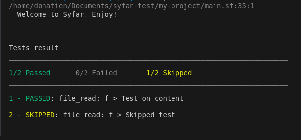
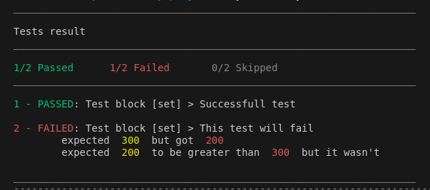

# My First Project

Welcome to your first experience with **Syfar**, a declarative language designed for testing. This guide will walk you through the steps of initializing and running your first Syfar project.

## Create a Project

To create a new project, simply run the following command:

```bash
syfar init my-project
```

Once the command is executed, you should see the following message:

```bash
Syfar project created successfully!
```

Now, navigate to the newly created project directory:

```bash
cd my-project
```


The `syfar init` command generates three files in the `my-project` directory to help you get started:

### 1. **syfar.json**
   This file defines basic project metadata and settings:

   ```json title="my-project/syfar.json"
   {
     "syfar_version": "0.1.0",
     "version": "1.0.0"
   }
   ```
   The `syfar.json` file acts as the project’s configuration file, allowing you to manage versioning and compatibility across different Syfar versions.

### 2. **file.txt**
   This file contains a simple message to welcome you to Syfar:

   ```text title="my-project/text.txt"
   Welcome to Syfar. Enjoy!
   ```

   This file is used in the example test within the project, and you can modify it to suit your specific use case or keep it as part of the demo to explore how Syfar interacts with files.

### 3. **main.sf**
   This is the core file where your Syfar test logic resides. It provides an example of how Syfar can be used to interact with files, using the **file provider**. In this file, we read the content of file.txt, test the content, output it, and display it using the print command. The second part, marked with ~, skips the test block.

   ```js title="my-project/main.sf"
   /**
       This is a simple example of using Syfar.
       It is based on the “file” provider provided to quickly get started with Syfar.
   */

   var filename = "file.txt"

   action file_read f {
       path = var.filename

       test "Test on content" {
           expect {
               r.content eq "Welcome to Syfar. Enjoy!"
           }
       }

       /**
        This test will be skipped
        Remove '~' to not skip
       */
       ~test "Skipped test" {
           expect {
               var.filename eq "I will fail if not skipped"
           }
       }
       out {
           text = r.content
       }
   }

   // Use print to output on console
   print {
       f.text
   }
   ```


## Run Your Project

Now that your project is created, you run it using the **run** command.

- **Running from your project folder**:
  
   Navigate to your project folder and run the following command:

   ```bash
   syfar run
   ```

- **Running from a parent folder**:

   If you're in the parent directory of your project, you can run the project by specifying its folder name:

   ```bash
   syfar run my-project
   ```

Both commands will execute the tests in your project and provide a complete overview of the test results.

<p align="center">
  
</p>


## Add More Tests in a New File

To expand your project, you can add additional test files. Let's create a new file named `my-file.sf` and add the following code:

```js title="my-project/my-file.sf"
var status = 200

tests "Test block" {
    test "Successful test" {
        expect {
            var.status eq 200
            var.status gt 100
        }
    }
    test "This test will fail" {
        expect {
            var.status eq 300
            var.status > 300
        }
    }
}
```

In this file:
- The first test checks if `status` is equal to 200 and greater than 100, which will pass.
- The second test checks if `status` equals 300 and is greater than 300, which will fail.

You can run this specific file with the following command:

```bash
syfar run my-file.sf
```

This allows you to focus on testing just this file without running the entire project.

<p align="center">

</p>

:::warning  Warning

Running your project with `syfar run` will **not** execute `my-file.sf` by default, as it is not imported in your `main.sf` file. To include it when running the project, add the following import directive to `main.sf`:

```syfar
import("my-file.sf")
```

Now, running the entire project with `syfar run` will also execute the tests in `my-file.sf`.

:::